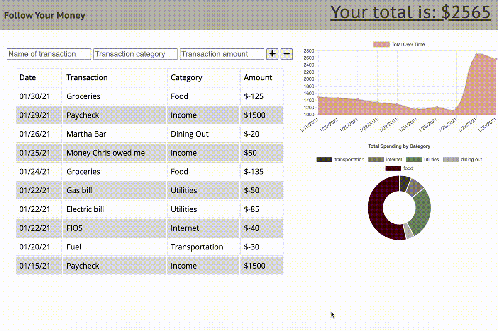

# Follow Your Money - A PWA Budget Tracker
Homework # 18 PWA: Online/Offline Budget Trackers

[Offline Budget Tracker Deploy Link](https://follow-yr-money.herokuapp.com/)

[](https://github.com/natemking/offline_budget_tracker/blob/main/LICENSE)


---
## Table of Contents
 * [Description](#description)
    + [Scope of Work](#scope-of-work)
    + [Progressive Web App Summary](#progressive-web-app-summary)
    + [Refactor and Redesign](#refactor-and-redesign)
    + [Added Functionality](#added-functionality)
    + [Modularization and Webpack](#modularization-and-webpack)
  * [Screenshots](#screenshots)
  * [Installation Notes](#installation-notes)
  * [License](#license)
  * [Credits](#credits)

## Description

### Scope of Work
User Story
```
AS AN avid traveller
I WANT to be able to track my withdrawals and deposits with or without a data/internet connection
SO THAT my account balance is accurate when I am traveling

```

We were provided with the boilerplate code of an already functioning budget app. The main task at hand was to convert it into a progressive web app. 

### Progressive Web App Summary 
Originally I had taken the boilerplate code and was easily able to add the necessary service worker registration code to the `index.html` file. Then I created the `serviceworker.js` file in the root directory. This code too is boilerplate. I had to update the `FILES_TO_CACHE` variable to point to the site's required files to cache. Lastly, I created a webmanifest from scratch that had all the pertinent info (icons, name, colors, etc..) for the app. With that, the bare minimum was complete. The basic app would allow the user to add transactions to the table on & offline. 

### Refactor and Redesign
With the bare minimum complete, I decided to see what I could do to really make this app useful. The first thing I did was to refactor my backend and folder structure. There was a lacking folder structure so I built out an MVC style layout and moved all files into their appropriate folders. I then separated the HTML & API routes into their own routers. Next, I  updated the models to use my code wherein the models `index.js` file is set up as a controller for any of the other models. While I am using Mongoose as my modeler, my code allows for it to act more like how Sequelize operates. Instead of an `index.js` file that just requires the models my `index.js` file, not only takes care of the MongoDb connection but also automates the model association. That way if the app were to scale up to more models, there would be no need to add each individual model in the index as the code takes care of the automation. 

I moved onto a redesign. The boilerplate was quite plain. All design was done simply via CSS and HTML. I rearranged the table and chart to sit side-by-side vs. the original vertical orientation. I added a navbar and moved the user's transaction totals into it. Then I brought in a new color palette. 

### Added Functionality 
I was not happy with the limitations this app had. It was only the C & R of CRUD. I wanted the app to do the full package. Plus I wanted another input of category for the user to get better metrics on what transactions they are recording. I coded the ability for the user to edit their entries by clicking on the table cell. The cell turns into a text input and allows the user to put the new data in and hit enter to save. I also added a delete function. I was not a fan of a delete button on every row in the DOM so I used CSS to hide the delete elements until a user hovers over them. Now that the user has full CRUD capabilities, the app is even more useful. 

Since I had added the input of category, I wanted the user to be able to see their spending per category. The boilerplate had come with a chart utilizing the chart.js CDN. It seemed only natural to display this spending per category data with another chart. This was tricky as I had to code a way for the duplicate keys to sum their values and only appear once for the data that is sent to the chart. I resolved it by using the `reduce()` method with a `for...of` loop nested inside. 

### Modularization and Webpack

With all the functionality and design updated, I went further yet. From adding all of the new CRUD functionality the `index.js` file was getting a little unruly. I decided to modularize the scripts and use Webpack to bundle for production. The separation of concerns that I chose to split the modules up into are as follows: index - calls the initial data get function and has the DOM event listeners, table - holds all of the CRUD functionality, chart - has all of the chart functionality, & total - has the function that calculates the transaction totals. 

Despite already making a service worker and webmanifest, I used the webpack-pwa-manifest plugin to have webpack generate new files to replace the ones I had created earlier. 

At the time of deployment, I had webpack minify my bundle for improved performance.

## Screenshots


<br>

_App Functionality_
<br>


## License
Licensed under the GNU GPLv3.0 License. Copyright © 2020

## Credits

* [Capitalize the first letter of every word with one line of code](https://www.freecodecamp.org/news/how-to-capitalize-words-in-javascript/)  

* [Random Color Palate](https://mycolor.space/)

* [Merge Multiple objects w/ sum of values by using the reduce() method](https://dev.to/ramonak/javascript-how-to-merge-multiple-objects-with-sum-of-values-43fd)

* [Using Fetch w/ async/await](https://dmitripavlutin.com/javascript-fetch-async-await/) 

* [Auto/ being applied the webpack-pwa-manifest icon file path output](https://github.com/arthurbergmz/webpack-pwa-manifest/issues/149)

* [Fix 'regenerator runtime is not defined error'](https://flaviocopes.com/parcel-regeneratorruntime-not-defined/)


* [Use CSS to have an element appear on hover](https://stackoverflow.com/questions/19062120/make-a-div-appear-on-hover-over-another-div) 

---

GitHub: [@natemking](https://github.com/natemking/)

Email: [natmeking@gmail.com](mailto:natmeking@gmail.com)

